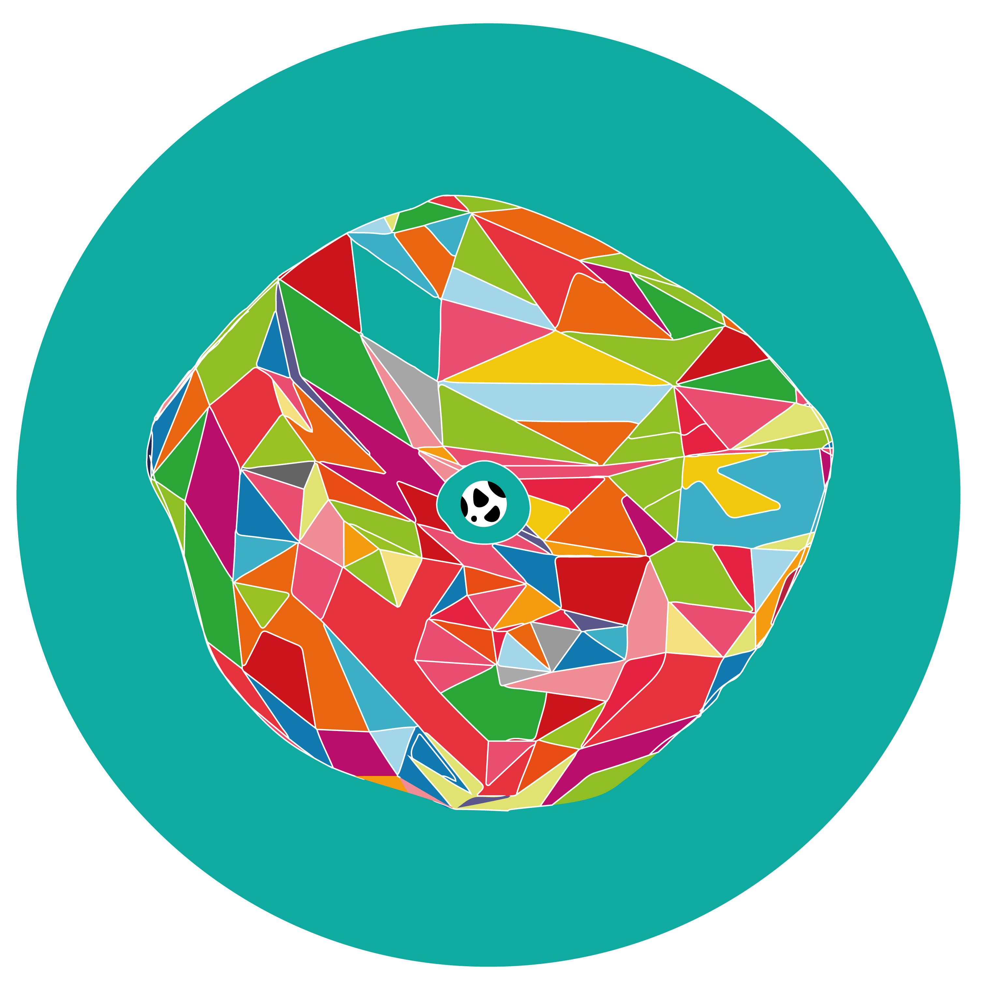
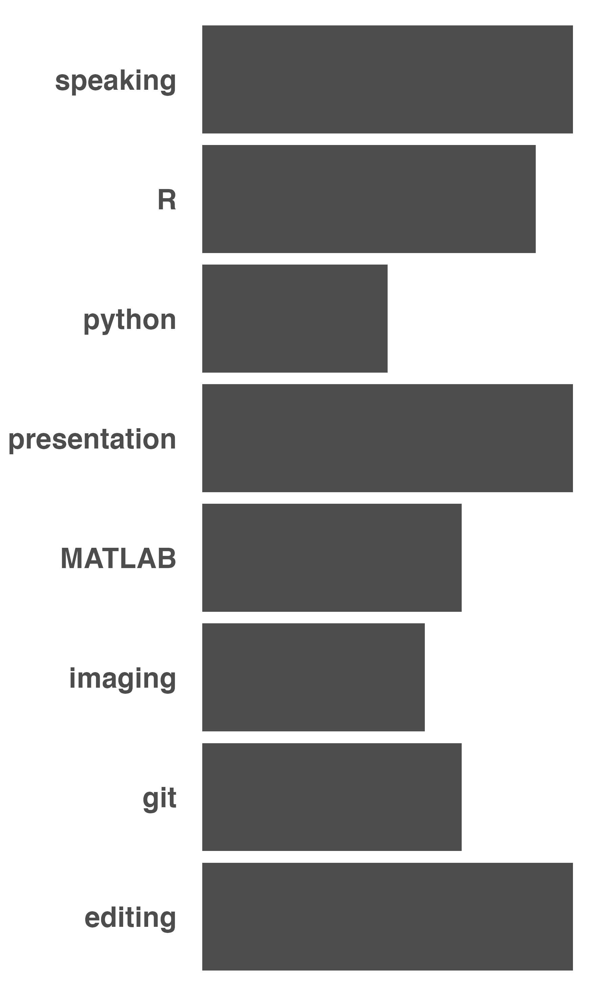

```{r startup, echo = FALSE, message = FALSE, warning = FALSE}
knitr::opts_chunk$set(
  results='asis',
  echo = FALSE,
  warning = FALSE,
  message = FALSE
)
library(pagedown)
library(tidyverse)
library(glue)
library(icons)
library(scholar)
library(formattable)
library(ggplot2)
library(magrittr) # For the pipe
library(plotly)
library(extrafont)
library(extrafontdb)
source("cv_printing_functions.r")
```

<!-- inicio academic icons -->
<link rel="stylesheet" href="https://cdn.jsdelivr.net/gh/jpswalsh/academicons@1/css/academicons.min.css">
<!-- final academic icons -->

 
<!-- inicio font awesome -->
<script src="https://kit.fontawesome.com/1f72d6921a.js" crossorigin="anonymous"></script>
<!-- final font awesome -->

```{r, include=FALSE}
# Read in all data and initialize a CV printer object
CV <- create_CV_object(
  data_location = "",  
  pdf_mode = params$pdf_mode
)
CV$entries_data <- CV$entries_data %>% dplyr::filter(in_resume == TRUE)
```


```{r}
# When in pdf export mode the little dots are unaligned, so fix that with some conditional CSS.
if(params$pdf_mode) {
    cat("
<style>
:root{
  --decorator-outer-offset-left: -6.5px;
}
</style>")
}
```

Aside
================================================================================

```{r logo}
cat("")
# Add plotly brain??
```

```{r pdf_mode}
if(params$pdf_mode){
  cat("View this resume online with links at asbates.com/CV")
} else {
  cat("<i class='fas fa-download'></i> [download this resume](https://alexanderbates.github.io/asbates/resume/index.pdf)")
}
```

Media {#Media}
--------------------------------------------------------------------------------

```{r contact_info}
CV$contact_info %>% glue_data("- <i class='fa fa-{icon}'></i> {contact}")
```

Software {#software}
--------------------------------------------------------------------------------

<i class="fas fa-box-open"></i> [natverse](https://natverse.org/) - a toolscape for neuroinformatics, co-author

<i class="fas fa-box-open"></i> [neuromorphr](https://natverse.github.io/neuromorphr/) - author

<i class="fas fa-box-open"></i> [neuronbridger](https://natverse.github.io/neuronbridger/) - author

<i class="fas fa-box-open"></i> [hemibrainr](https://natverse.github.io/hemibrainr/) - author

<i class="fas fa-box-open"></i> [mouselightr](https://natverse.github.io/mouselightr/) - author

<i class="fas fa-box-open"></i> [insectbrainr](https://natverse.github.io/insectbrainr/) - author

Main
================================================================================

Alexander Shakeel Bates {#title}
--------------------------------------------------------------------------------

```{r intro}
print_text_block(CV, 'intro')
```

```{r profile, fig.align = "center"}
id <- "BOVTiXIAAAAJ&hl"
author <- scholar::get_profile(id)
df <- data.frame(total_cites = author$total_cites, h_index = author$h_index, i10_index = author$i10_index)
formattable(df, list(total_cites = color_bar("coral", fun = "normalize"), h_index = color_bar("lightgreen", fun = "proportion"), i10_index = color_bar("lightblue", fun = "proportion")))
```

Professional Research {data-icon=microscope}
--------------------------------------------------------------------------------

```{r research}
CV %<>% print_section('research_projects')
```


Grants {data-icon=connectdevelop}
--------------------------------------------------------------------------------

```{r grants}
CV %<>% print_section('grants')
```

Education {data-icon=graduation-cap data-concise=true}
--------------------------------------------------------------------------------

```{r}
CV %<>% print_section('education')
```


::: aside

**SKILLS**

```{r skill_bar}
# print_skill_bars(CV)
# p <-ggplot(data=CV$skills, aes(x=skill, y=level)) +
#   geom_bar(stat="identity", fill="#4D4D4D")+
#   coord_flip() + 
#   theme(
#     axis.title.y = element_blank(),
#     axis.title.x = element_blank(),
#     axis.text.y = element_text(size=20, face="bold", colour = "#4D4D4D", family = "sans"),
#     axis.text.x=element_blank(),
#     axis.ticks.y=element_blank(),
#     axis.ticks.x=element_blank(),
#     panel.background = element_rect(fill = "transparent"), # bg of the panel
#     plot.background = element_rect(fill = "transparent", color = NA), # bg of the plot
#     panel.grid.major = element_blank(), # get rid of major grid
#     panel.grid.minor = element_blank(), # get rid of minor grid
#     legend.background = element_rect(fill = "transparent"), # get rid of legend bg
#     legend.box.background = element_rect(fill = "transparent") # get rid of legend panel bg
#   )
# ggsave(p, filename = "skills.png",  bg = "transparent", units = "cm", height = 25, width = 15)
# cat("")
```

- <i class="fab fa-r-project"></i> `R`

- <i class="fab fa-python"></i> `python`

- <i class="fab fa-function"></i> `matlab`

- <i class="fas fa-code-branch"></i> `Git`

- <i class="fab fa-github"></i> `GitHub`

- <i class="fab fa-markdown"></i> `Markdown`

- <i class="fas fa-image"></i> `Illustrator`

- <i class="fas fa-file"></i> `InDesign`

- <i class="fas fa-user-edit"></i> `text editing`

- <i class="fas fa-chalkboard-teacher"></i> `communication`

- <i class="fas fa-pen-fancy"></i> `journalistic writing`

- <i class="fas fa-pen"></i> `creative writing`

:::

Awards {data-icon=award}
--------------------------------------------------------------------------------

```{r awards}
CV %<>% print_section('awards')
```

::: aside

**REFEREES** 

- <i class="fas fa-robot"></i> `PhD Supervisor: Dr. Gregory Jefferis, MRC Laboratory of Molecular Biology, Cambridge, jefferis@mrc-lmb.cam.ac.uk`

- <i class="fas fa-user-secret"></i> `Current Supervisor: Prof. Rachel Wilson, Harvard Medical School, Rachel_Wilson@hms.harvard.edu`

- <i class="fas fa-user-graduate"></i> `BSc Tutor at UCL: Dr. Marco Beato, UCL Neuroscience, Physiology and Pharmacology, m.beato@ucl.ac.uk`

- <i class="fas fa-user-astronaut"></i> `Supervisee: Serene Dhawan, The Francis Crick Institute, serenedhawan@gmail.com`

:::

Leadership {data-icon=flag}
--------------------------------------------------------------------------------

```{r leadership}
CV %<>% print_section('leadership_experience')
```

Publications {data-icon=book}
--------------------------------------------------------------------------------

::: aside

```{r pubs}
print_text_block(CV, 'publications')
```

:::

```{r publications}
#CV %<>% print_section('publications')
publications <- scholar::get_publications(id, sortby = "year", pagesize = 100, flush = TRUE)
publications <- subset(publications, ! journal %in% c("CHEMICAL SENSES","University of Cambridge",""))
authorlist <- publications$author
publications$journal[publications$journal %in% c("BioRxiv","Biorxiv","biorxiv")] <- "bioRxiv"
publications$position <- author_position(authorlist, scholar::get_profile(id)$name)$Position
publications$position[is.na(publications$position)] = 6
publications$IF <- get_impactfactor(publications$journal, max.distance = 0.05)$ImpactFactor
publications$IF[is.na(publications$IF)] = 0
publications$position[publications$title=='Information flow, cell types and stereotypy in a full olfactory connectome'] = 1
articles = unique(publications$cid)
formattable(publications, list(
  position = color_bar("lightgreen", fun = "normalize"),
  cites = color_bar("coral", fun = "normalize"),
  IF = color_bar("lightblue", fun = "normalize"),
  number = FALSE,
  cid = FALSE,
  pubid = FALSE))
```

Selected Talks {data-icon=chalkboard-teacher}
--------------------------------------------------------------------------------

```{r meetings}
CV %<>% print_section('meetings')
```

Selected Posters {data-icon=chart-area}
--------------------------------------------------------------------------------

```{r posters}
CV %<>% print_section('posters')
```

Other {data-icon=share-alt}
--------------------------------------------------------------------------------

```{r other}
CV %<>% print_section('experience')
```

::: aside

Disclaimer {#disclaimer}
--------------------------------------------------------------------------------

Made with the R package [**pagedown**](https://github.com/rstudio/pagedown) and [**datadrivencv**](http://nickstrayer.me/datadrivencv/index.html).

Code available on <i class="fa fa-github"></i> [GitHub](https://github.com/alexanderbates/asbates). 

Last updated on `r Sys.Date()`. 

:::

```{r links}
if(params$pdf_mode) {
  CV %<>% print_links()
}
```

